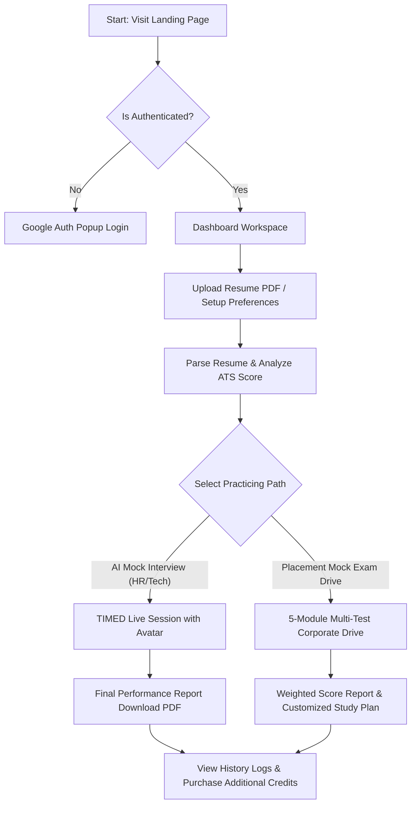
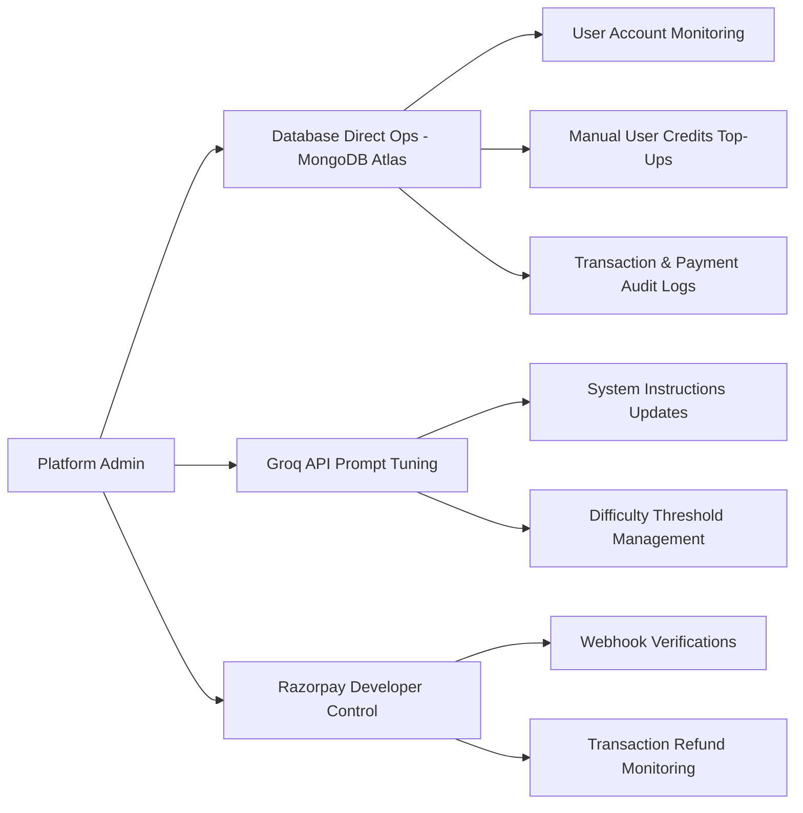
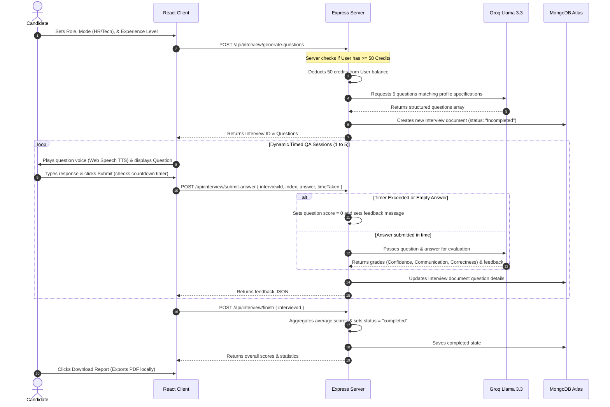
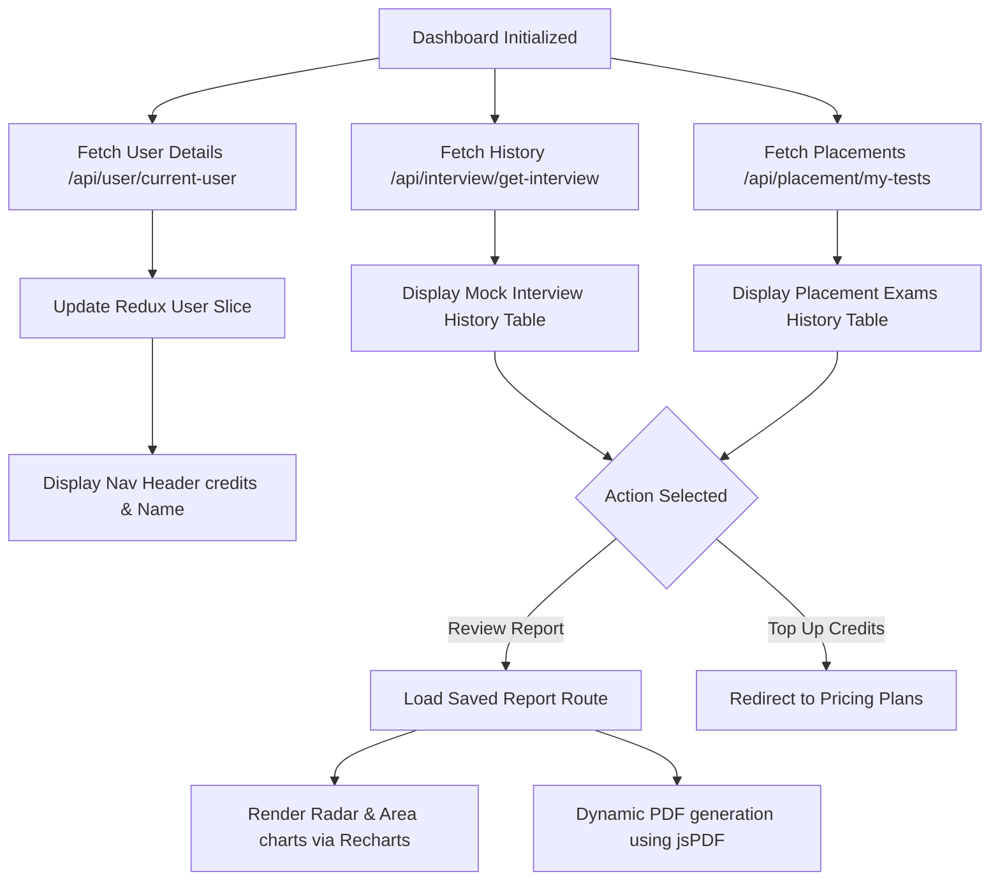
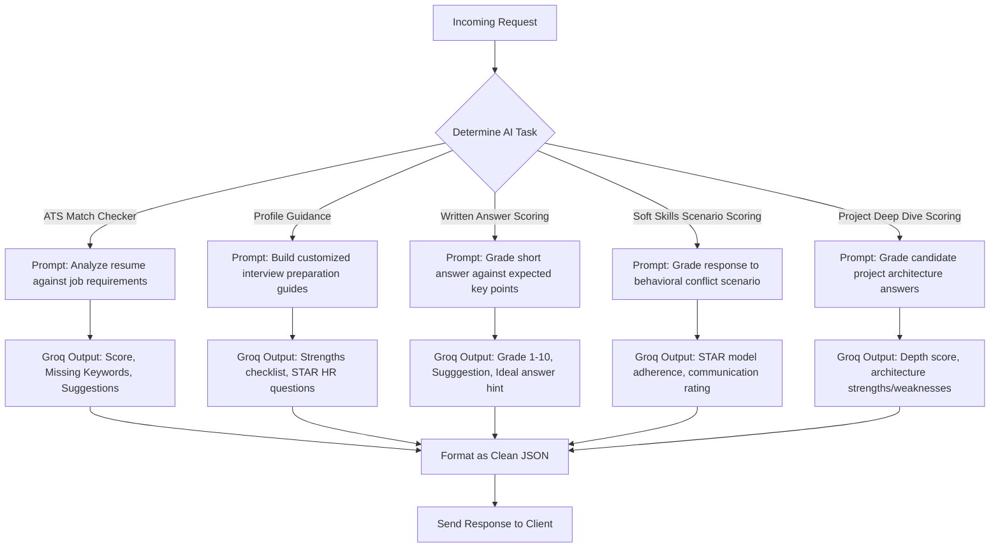
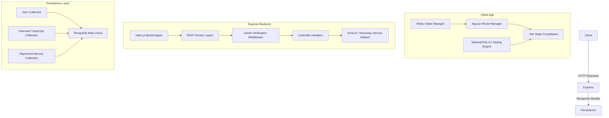

# 🎯 ApnaCoach — AI-Powered Interview Practice & Placement Preparation Platform

<p align="center">
  
  
  
  
  
  
  
  
  
  
  
  
</p>

---

## 📖 Project Overview

**ApnaCoach** is a full-stack, enterprise-grade AI-powered mock interview and comprehensive placement preparation platform. The platform merges dual career-readiness methodologies into a single unified workspace:
1. **AI Conversational Mock Interviews (HR & Technical):** An interactive, timed, voice-assisted interview where a candidate faces context-aware questions based on their resume, target role, and experience level, speaking or typing responses under real pressure against an AI Avatar.
2. **Placement Mock Exam Drives:** A multi-module corporate exam simulation mimicking high-standard recruitment drives. It incorporates Technical MCQs, Knowledge Depth (Written), Aptitude & Reasoning, Soft Skills Scenarios, and Project Deep Dives, calculating a weighted readiness score with a structured career learning plan.

---

## ⚠️ Problem Statement

Standard interview preparation resources are passive, disjointed, and generic. Candidates face significant barriers:
- **High Costs of Mentorship:** Face-to-face coaching from experts is prohibitively expensive ($100+/hour), making it inaccessible for the average candidate or student.
- **Lack of Practical Pressure:** Reading static lists of questions doesn't simulate real-world anxiety. Candidates struggle to perform under timed, interactive conditions.
- **Opaque Resume Alignment:** Generic resume builders fail to evaluate whether a candidate's profile is actually compatible with Applicant Tracking Systems (ATS) or specific corporate criteria.
- **Inadequate Assessment:** Existing platforms focus solely on technical coding or simple MCQ tests, failing to measure communication clarity, confidence, depth of project knowledge, and verbal soft skills simultaneously.

**ApnaCoach** solves these challenges by providing a fully interactive, automated, credit-based coach that extracts profile context directly from uploaded resumes, holds realistic timed speaking/typing assessments, and generates structured feedback with data-backed metrics instantly.

---

## ✨ Key Features

- 🤖 **AI-Driven Conversational Interviews:** Context-aware behavioral or technical questions generated on-the-fly using **Groq Cloud AI (Llama 3.3 70B)**, aligned to experience level and resume content.
- 📄 **Interactive PDF Resume Extraction:** Drag-and-drop resume parser that extracts role, education, skills, projects, and summary metrics on-the-fly using server-side **PDF.js** and LLM structuring.
- 📈 **ATS Review & Score Checker:** Instant analysis of resume text against target job descriptions, outputting a match percentage, key achievements, missing keywords, and specific bullet suggestions.
- 🧠 **Multi-Module Placement Exam Drives:** A complete mock recruitment pathway including:
  1. **Technical MCQs** (12 Questions — 25 Minutes)
  2. **Knowledge Depth (Written)** (4 Questions — 30 Minutes)
  3. **Aptitude & Reasoning** (10 Questions — 20 Minutes)
  4. **Soft Skills & Communication** (5 Questions — 20 Minutes)
  5. **Project Deep Dive** (4 Questions — 15 Minutes — dynamically skipped if no projects are on resume)
- 📊 **Multi-Dimensional Evaluation:** Grading along three vital metrics: **Confidence**, **Communication**, and **Correctness**, detailed down to every question.
- 📅 **Custom Learning Roadmaps:** Detailed career tracks with a week-by-week layout, milestone checklists, and direct references to high-quality free education channels.
- 📥 **Interactive PDF Reports:** Clean, structured, resume-style final performance reviews downloadable offline via **jsPDF + AutoTable**.
- 💳 **Razorpay Integration & Credit System:** Secure pack-purchase with HMAC-SHA256 signature verification. New users start with 100 free credits, and each session costs 50 credits.
- 🔐 **Firebase Auth with HttpOnly Sessions:** Seamless Google Login combined with backend JWT cookie authorization for secure persistent sessions.

---

## 🛠️ Tech Stack

### Frontend (Client)
| Technology | Version | Purpose |
| :--- | :--- | :--- |
| **React** | `^19.0` | Declarative component-based UI |
| **Vite** | `^7.0` | Ultra-fast local compilation, build tool, and module bundler |
| **TailwindCSS** | `^4.0` | Sleek modern CSS styles, grid systems, and custom theme layouts |
| **Redux Toolkit** | `^2.x` | Global state containment (user data, interview sessions) |
| **React Router DOM** | `^7.x` | Fluid client-side router navigation with route guards |
| **Firebase** | `^12.x` | Google single-sign-on client integration |
| **Axios** | `^1.x` | Promise-based HTTP requests with credential support |
| **Recharts** | `^3.x` | Dynamic responsive SVG area/radar score charts |
| **React Circular Progressbar**| `^2.x` | Elegant visual radial loading indicators |
| **Framer Motion (Motion)** | `^12.x` | Smooth state transitions, hover micro-interactions, and fade-ins |
| **jsPDF & AutoTable** | `^4.x / ^5.x` | Programmatic PDF design, data mapping, and local export |

### Backend (Server)
| Technology | Version | Purpose |
| :--- | :--- | :--- |
| **Node.js** | `^18.x / ^20.x` | Fast, scalable, asynchronous event-driven server runtime |
| **Express.js** | `^5.0` | REST API routes, cookie parsing, and request handling |
| **MongoDB Atlas** | — | Fully managed Cloud Document Database |
| **Mongoose** | `^9.x` | Schema-based ODM for modeling user profiles and transcripts |
| **Razorpay SDK** | `^2.x` | Standardized payment order generation and webhook verification |
| **pdfjs-dist (legacy)** | `^5.x` | Server-side binary parsing and text extraction of PDF uploads |
| **Multer** | `^2.x` | Robust middleware handling multi-part/form-data for file uploads |
| **jsonwebtoken (JWT)** | `^9.x` | Stateless HttpOnly cookie token generation and validation |
| **bcryptjs / crypto** | Built-in | Secure hashing and signature authentication for payment checking |

---

## 🏗️ System Architecture

The ApnaCoach platform is designed as a secure, decoupled, client-server system communicating over a RESTful interface. All sessions are protected by standard HttpOnly authentication cookies.

```
                  ┌────────────────────────────────────────────────────────┐
                  │                  React Client (Vite)                   │
                  │   ┌──────────────┐ ┌──────────────┐ ┌──────────────┐   │
                  │   │ Firebase Auth│ │ Redux Store  │ │ React Router │   │
                  │   │ (SSO Login)  │ │ (User/State) │ │ (12+ Routes) │   │
                  │   └──────┬───────┘ └──────────────┘ └──────┬───────┘   │
                  └──────────┼─────────────────────────────────┼───────────┘
                             │                                 │
                 Firebase ID │                                 │ HTTP Requests
                 Token (Auth)│                                 │ (Axios + Cookies JWT)
                             ▼                                 ▼
                  ┌────────────────────────────────────────────────────────┐
                  │                 Node.js + Express.js                   │
                  │    ┌──────────────────────────────────────────────┐    │
                  │    │           API Routing & Controller           │    │
                  │    │      (Auth, Resume, Questions, Placement)     │    │
                  │    └──────────────────────┬───────────────────────┘    │
                  │                           │                            │
                  │              isAuth (JWT verification)                 │
                  └───────────────────────────┼────────────────────────────┘
                                              │
                              ┌───────────────┴───────────────┐
                              ▼                               ▼
                  ┌──────────────────────┐        ┌──────────────────────┐
                  │    MongoDB Atlas     │        │    External APIs     │
                  │   ┌──────────────┐   │        │   ┌──────────────┐   │
                  │   │    Users     │   │        │   │  Groq Cloud  │   │
                  │   ├──────────────┤   │        │   │ (Llama 3.3)  │   │
                  │   │  Interviews  │   │        │   ├──────────────┤   │
                  │   ├──────────────┤   │        │   │   Razorpay   │   │
                  │   │  Placements  │   │        │   │  (Payments)  │   │
                  │   ├──────────────┤   │        │   └──────────────┘   │
                  │   │   Payments   │   │        │                      │
                  │   └──────────────┘   │        │                      │
                  └──────────────────────┘        └──────────────────────┘
```

### Architectural Highlights
- **Decoupled Client & Server:** All client logic runs in the browser, compiling down to standard HTML5/JS/CSS assets. The backend operates completely headlessly.
- **Cookie-Based Stateless Session:** Unlike classic localStorage tokens, JWT tokens are placed in `HttpOnly`, `Secure` (in production) cookies, completely protecting sessions against XSS token extraction.
- **On-Demand AI Streaming (Groq Llama 3.3 70B):** Generates structural technical and soft-skill scenarios dynamically. Utilizing the Groq API enables extremely fast JSON-formatted prompt evaluation.

---

## 📁 Folder Structure

The project has been fully restructured into **exactly two directories** for cleaner deployment and maintenance.

```
ApnaCoach_AI_Interview_Platform/
│
├── client/                              # React frontend (Vite)
│   ├── public/                          # Static public assets (Favicons, logos)
│   └── src/
│       ├── assets/                      # Global images, dynamic SVG styles, and visuals
│       ├── components/                  # Reusable UI widgets
│       │   ├── Navbar.jsx               # Floating navigation header + auth controllers
│       │   ├── Step1SetUp.jsx           # Form gathering job preferences & resume upload
│       │   ├── Step2Interview.jsx       # Conversational AI mock interview simulator
│       │   ├── Step3Report.jsx          # Interactive report drawer with graphical charts
│       │   ├── Timer.jsx                # Circular visual countdown timer
│       │   ├── Footer.jsx               # Footer containing company metadata
│       │   └── AuthModel.jsx            # Dynamic floating overlay login prompt
│       ├── pages/                       # Screen views mounted on routes
│       │   ├── Home.jsx                 # High-converting SaaS landing page
│       │   ├── Auth.jsx                 # Secured login, registration interface
│       │   ├── InterviewPage.jsx        # Orchestrates the 3-step live mock interview
│       │   ├── InterviewReport.jsx      # Standalone historical report viewer
│       │   ├── InterviewHistory.jsx     # Lists all user interview & placement logs
│       │   ├── Pricing.jsx              # Pricing packaging with Razorpay trigger
│       │   ├── Guidance.jsx             # Comprehensive resume overview + ATS checker
│       │   ├── ResumeTips.jsx           # Structured resume-writing manual
│       │   ├── CompanyPrep.jsx          # Dynamic roadmap preparations for major tech firms
│       │   ├── Roadmap.jsx              # Interactive learning timeline & paths
│       │   ├── PlacementTestPage.jsx    # The multi-stage placement exam engine
│       │   └── PlacementResultsPage.jsx # Weighted multi-category score breakdown
│       ├── redux/                       # Global state management
│       │   ├── store.js                 # Redux store configuration
│       │   ├── userSlice.js             # User data & active credit balance state
│       │   └── interviewSlice.js        # Current interview session state
│       ├── utils/                       # Configuration, constants, and endpoints
│       ├── App.jsx                      # App root component declaring router pathways
│       ├── main.jsx                     # React DOM entry point
│       └── index.css                    # Modern Tailwind CSS 4 setup and global styling
│
├── server/                              # Node.js + Express backend
│   ├── config/
│   │   └── connectDb.js                 # Mongoose DB connection pool config
│   ├── controllers/
│   │   ├── auth.controller.js           # Google token verification & JWT token issue
│   │   ├── user.controller.js           # Current user Profile retrieval
│   │   ├── interview.controller.js      # Timing-based interview logic & evaluation
│   │   ├── resume.controller.js         # ATS check, resume parsing & custom guidance
│   │   ├── questions.controller.js      # Dynamic multi-mode placement question generator
│   │   ├── evaluate.controller.js       # Placement answer grading (written, MCQs, soft skills)
│   │   └── payment.controller.js        # Razorpay session creation & signature verification
│   ├── middlewares/
│   │   └── isAuth.js                    # JWT HttpOnly Cookie parsing credential checker
│   ├── models/
│   │   ├── user.model.js                # User DB Schema (name, email, credit balance)
│   │   ├── interview.model.js           # Timing-based interview & graded response arrays
│   │   ├── placement.model.js           # Multi-test placement drive scores and study plans
│   │   └── payment.model.js             # Razorpay payment orders & transaction status schema
│   ├── routes/
│   │   ├── auth.route.js                # Auth pathways
│   │   ├── user.route.js                # Current user data check
│   │   ├── interview.route.js           # Live interview generation & evaluation routes
│   │   ├── resume.route.js              # ATS check, extraction, and career tips
│   │   ├── questions.route.js           # Placement question generators
│   │   ├── evaluate.route.js            # Grading modules for MCQ & written placement parts
│   │   ├── placement.route.js           # Placement mock exam records save/history
│   │   └── payment.route.js             # Order placement and verification
│   ├── services/
│   │   ├── groq.service.js              # Groq Cloud API wrapper (Llama 3.3 70B interface)
│   │   ├── openRouter.service.js        # Alternate backup LLM routing
│   │   ├── scorer.service.js            # Algorithmic weights calculator & MCQ grading engine
│   │   └── razorpay.service.js          # Razorpay client instance
│   ├── public/                          # Multer's local buffer storage directory
│   ├── scratch/                         # Dedicated folder for testing scripts
│   │   └── test_ai_questions.js         # Groq API MCQ question generation sandbox script
│   └── index.js                         # Application bootstrapper
│
├── .gitignore                           # Configures globally ignored files
└── README.md                            # Comprehensive platform documentation
```

---

## 🔄 Workflow Diagram Explanation

To clarify the unified data flow across the entire platform, here is an explanation of the user's operational path:

```
[Candidate Profile Setup] 
      │ 
      ├───► Uploads Resume (PDF) ───► Multer File Buffer ───► PDF.js Text Extractor ───► Groq Structured Parsing
      │                                                                                      │
      ├─► Manual Job Roles Select ◄──────────────────────────────────────────────────────────┘
      │
      ▼
[Choose Assessment Path]
      │
      ├─► Option A: AI Conversational Interview (HR / Technical)
      │      │
      │      ├─► Deduct 50 Credits ───► Groq AI generates 5 Conversational Questions
      │      ├─► Live TIMED Session (Candidate speaks/types answers; AI voice speaks questions via Web TTS)
      │      ├─► submitAnswer (Groq grades each answer instantly on Correctness, Confidence, and Communication)
      │      └─► finishInterview (Compile overall averages & exports jsPDF custom report)
      │
      └─► Option B: Placement Mock Exam Drive (Multi-Module Recruitment Simulation)
             │
             ├─► Deduct 50 Credits ───► Groq AI generates 5-part Placement Questions
             ├─► Test 1: Technical MCQ Test (12 MCQs — graded instantly on scorer service)
             ├─► Test 2: Knowledge Depth (4 Written Qs — graded on expected keywords via Groq)
             ├─► Test 3: Aptitude & Reasoning (10 Reasoning MCQs — algorithmic grading)
             ├─► Test 4: Soft Skills (5 Situational HR Qs — STAR methodology checking via Groq)
             ├─► Test 5: Project Deep Dive (4 Qs on Resume projects — dynamic skip if none)
             └─► savePlacementTest ───► Calculate Weighted Overall Score ───► Generate Personalized Weekly Study Plan
```

---

## 🔐 Authentication Flow

Secure session management is enforced through a dual-validation token strategy:

```
[Candidate Browser]                    [Firebase SSO]                   [ApnaCoach Server]
        │                                     │                                 │
        │ 1. Click "Google Sign In"           │                                 │
        ├────────────────────────────────────►│                                 │
        │                                     │                                 │
        │ 2. Return User Profile + ID Token   │                                 │
        │◄────────────────────────────────────┤                                 │
        │                                     │                                 │
        │ 3. POST /api/auth/google (ID Token) │                                 │
        ├─────────────────────────────────────┼────────────────────────────────►│
        │                                     │                                 │
        │                                     │ 4. Verify ID Token credentials  │
        │                                     │◄───────────────────────────────┤
        │                                     │                                 │
        │                                     │ 5. Lookup/Create User in DB     │
        │                                     │    & Sign JWT Cookie (HttpOnly) │
        │                                     │────────────────────────────────►│
        │                                     │                                 │
        │ 6. Response 200 (Success & Cookie)  │                                 │
        │◄────────────────────────────────────┴─────────────────────────────────┤
        │                                                                       │
        │ 7. Subsequent Requests (Browser implicitly passes JWT inside Cookie)  │
        ├──────────────────────────────────────────────────────────────────────►│
        │                                                                       │
        │                                     │ 8. isAuth Middleware decodes JWT│
        │                                     │    sets req.userId on request   │
        │                                     │◄────────────────────────────────┤
```

---

## 🔌 API Flow

All communication endpoints conform to REST rules, consuming/returning standard JSON data and requiring valid authorization cookies (unless marked public).

### Authentication & User Services
| Method | Endpoint | Headers / Payload | Description | Response JSON |
| :--- | :--- | :--- | :--- | :--- |
| `POST` | `/api/auth/google` | `{ idToken: "firebase_id_token" }` | Verifies Google SSO and issues a secure JWT cookie. | `{ message: "successful login", user: { name, email, credits } }` |
| `GET` | `/api/auth/logout` | None (reads cookie) | Clears the persistent HttpOnly JWT credential cookie. | `{ message: "logged out successfully" }` |
| `GET` | `/api/user/current-user` | JWT Cookie | Retrieves details and credit balances for the logged-in candidate. | `{ _id, name, email, credits, createdAt }` |

### Resume Parsing & Career Guidance
| Method | Endpoint | Headers / Payload | Description | Response JSON |
| :--- | :--- | :--- | :--- | :--- |
| `POST` | `/api/interview/resume` | `FormData` (contains binary PDF file in `file` field) | Temporary uploads, parses, and extracts structured data from PDF resume. | `{ role, experience, projects: [], skills: [], resumeText }` |
| `POST` | `/api/interview/resume/parse` | `{ resume_text: "...", target_role: "..." }` | Standardized payload parser mapping resume contents directly. | `{ name, skills: [], projects: [], experience_level, education, summary }` |
| `POST` | `/api/interview/resume/ats-check` | `{ resume_text: "...", target_role: "..." }` | Evaluates ATS compatibility and provides exact scoring and keyword tips. | `{ ats_score: 72, matched_keywords: [], missing_keywords: [], suggestions: [], verdict }` |
| `POST` | `/api/interview/resume/guidance` | `{ resume_text: "...", target_role: "..." }` | Evaluates resume to produce specific Technical & HR mock preparations. | `{ summary, skillsChecklist: [], projectGuidance: [], customTechnicalTips: [], customHrTips: [] }` |

### AI Timed Mock Interviews
| Method | Endpoint | Headers / Payload | Description | Response JSON |
| :--- | :--- | :--- | :--- | :--- |
| `POST` | `/api/interview/generate-questions` | `{ role, experience, mode, resumeText, projects: [], skills: [] }` | Checks credits (min 50 required), deducts 50 credits, and generates 5 timed questions. | `{ interviewId, creditsLeft, userName, questions: [{ question, difficulty, timeLimit }] }` |
| `POST` | `/api/interview/submit-answer` | `{ interviewId, questionIndex, answer, timeTaken }` | Compares timer constraints, grades response, and scores individual attributes. | `{ feedback: "Short professional interviewer review statement" }` |
| `POST` | `/api/interview/finish` | `{ interviewId }` | Finalizes interview, calculates average scores, updates status to completed. | `{ finalScore: 7.2, confidence: 8.0, communication: 7.0, correctness: 6.5, questionWiseScore: [] }` |
| `GET` | `/api/interview/get-interview` | JWT Cookie | Lists history of all mock interview sessions created by the user. | `[{ _id, role, experience, mode, finalScore, status, createdAt }]` |
| `GET` | `/api/interview/report/:id` | `params.id` in URL | Retrieves detailed graded answers for a single historical interview. | `{ finalScore, confidence, communication, correctness, questionWiseScore: [] }` |

### Placement Exam Drives
| Method | Endpoint | Headers / Payload | Description | Response JSON |
| :--- | :--- | :--- | :--- | :--- |
| `POST` | `/api/questions/generate` | `{ resume_data, target_role, test_type, difficulty_mode, question_count }` | Dynamic single-module placement questions generator (technical, written, aptitude, softskills, projects). | `{ test_type, questions: [], total, time_limit_seconds }` |
| `POST` | `/api/evaluate/mcq` | `[{ question_id, selected_answer, correct_answer, explanation }]` | Algorithmic grading of MCQ blocks, returning exact points. | `{ results: [], correct, total, percentage, score_out_of_10 }` |
| `POST` | `/api/evaluate/written` | `{ question, answer, key_points, role, level }` | Structural LLM check of open-text answer matching key scoring points. | `{ score, verdict, strengths: [], weaknesses: [], suggestion, ideal_answer_hint }` |
| `POST` | `/api/evaluate/softskill` | `{ scenario, question, answer, role }` | Evaluates HR situational answers against the STAR method (Situation, Task, Action, Result). | `{ score, verdict, strengths: [], weaknesses: [], suggestion, star_method_used }` |
| `POST` | `/api/evaluate/project` | `{ question, answer, role }` | Evaluates project depth and technical architecture explanations. | `{ score, verdict, strengths: [], weaknesses: [], suggestion, depth_of_knowledge }` |
| `POST` | `/api/evaluate/final-report` | `{ candidate_name, target_role, level, test_scores: [], all_weaknesses: [], all_strengths: [] }` | Compiles a full mock placement review containing ready-in durations and customized study tracks. | `{ overall_score, overall_percentage, rating, summary, study_plan: [], readiness_score }` |
| `POST` | `/api/placement/save` | `{ candidateName, targetRole, level, testScores: [], allStrengths: [], allWeaknesses: [], finalReport }` | Checks credits (min 50), deducts 50 credits, saves completed placement report. | `{ message: "Placement test saved", creditsLeft, testId }` |
| `GET` | `/api/placement/my-tests` | JWT Cookie | Fetches chronological logs of completed placement tests. | `[{ _id, targetRole, level, finalReport, createdAt, status }]` |
| `GET` | `/api/placement/report/:id` | `params.id` in URL | Fetches individual module scores, strengths, and study plan for a placement drive. | Complete `PlacementTest` database object |

### Payment Processing
| Method | Endpoint | Headers / Payload | Description | Response JSON |
| :--- | :--- | :--- | :--- | :--- |
| `POST` | `/api/payment/order` | `{ planId: "starter/pro/elite" }` | Generates a verified transaction order inside Razorpay API. | `{ orderId, amount, currency, credits }` |
| `POST` | `/api/payment/verify` | `{ razorpayOrderId, razorpayPaymentId, razorpaySignature }` | Performs HMAC-SHA256 signature verification and issues user credits. | `{ status: "success", creditsLeft }` |

---

## 💾 Database Design Overview

The database uses MongoDB Atlas with strictly defined Mongoose models to enforce relational integrity and optimal index query patterns.

### 1. User Model (`User`)
Stores authorization identifiers, profile metadata, and available transaction tokens.
```javascript
const userSchema = new mongoose.Schema({
  name: { type: String, required: true },
  email: { type: String, unique: true, required: true },
  credits: { type: Number, default: 100 }
}, { timestamps: true });
```

### 2. Interview Model (`Interview`)
Stores session configurations, generated questions, candidates' transcripts, and individual graded scores.
```javascript
const questionsSchema = new mongoose.Schema({
  question: String,
  difficulty: String,
  timeLimit: Number,
  answer: String,
  feedback: String,
  score: { type: Number, default: 0 },
  confidence: { type: Number, default: 0 },
  communication: { type: Number, default: 0 },
  correctness: { type: Number, default: 0 }
});

const interviewSchema = new mongoose.Schema({
  userId: { type: mongoose.Schema.Types.ObjectId, ref: "User", required: true },
  role: { type: String, required: true },
  experience: { type: String, required: true },
  mode: { type: String, enum: ["technical", "hr"], required: true },
  resumeText: { type: String },
  questions: [questionsSchema],
  finalScore: { type: Number, default: 0 },
  status: { type: String, enum: ["Incompleted", "completed"], default: "Incompleted" }
}, { timestamps: true });
```

### 3. Placement Test Model (`PlacementTest`)
Captures multi-test placement drives, including candidate scores across 5 different modules, strengths/weaknesses summary list, and complete personalized study plans.
```javascript
const placementTestSchema = new mongoose.Schema({
  userId: { type: mongoose.Schema.Types.ObjectId, ref: "User", required: true },
  candidateName: { type: String, required: true },
  targetRole: { type: String, required: true },
  level: { type: String, required: true },
  difficultyMode: { type: String, default: "medium" },
  resumeText: { type: String },
  resumeData: {
    name: { type: String },
    skills: [{ type: String }],
    projects: [{ name: { type: String }, description: { type: String } }],
    experience_level: { type: String },
    education: { type: String },
    summary: { type: String }
  },
  testScores: [{
    test_name: { type: String },
    test_type: { type: String },
    score: { type: Number },
    total: { type: Number },
    percentage: { type: Number },
    score_out_of_10: { type: Number }
  }],
  allStrengths: [{ type: String }],
  allWeaknesses: [{ type: String }],
  finalReport: {
    overall_score: { type: Number },
    overall_percentage: { type: Number },
    rating: { type: String },
    summary: { type: String },
    positive_areas: [{ type: String }],
    negative_areas: [{ type: String }],
    study_plan: [{ topic: { type: String }, priority: { type: String }, resource: { type: String } }],
    readiness_score: { type: Number },
    estimated_ready_in: { type: String }
  },
  status: { type: String, enum: ["Incompleted", "completed"], default: "completed" }
}, { timestamps: true });
```

### 4. Payment Model (`Payment`)
Tracks transactional packages, order tokens, and checkout verification logs.
```javascript
const paymentSchema = new mongoose.Schema({
  userId: { type: mongoose.Schema.Types.ObjectId, ref: "User", required: true },
  planId: String,
  amount: Number,
  credits: Number,
  razorpayOrderId: String,
  razorpayPaymentId: String,
  status: { type: String, enum: ["created", "paid", "failed"], default: "created" }
}, { timestamps: true });
```

---

## 🚀 Installation & Local Development Setup

Follow these structured instructions to configure the workspace environment and launch both frontend and backend development configurations locally.

### Prerequisites
- **Node.js** v18.x or higher installed.
- **npm** (comes with Node.js) or **yarn** package managers.
- A **MongoDB Atlas** database connection URL.
- A **Groq Cloud API Key** (register free on Groq Cloud).
- A **Firebase Project** with Google Authentication enabled.
- A **Razorpay Developer Account** (for API order transaction keys).

---

### 1. Environment Variables Configuration

Create independent environment configuration files within each project folder.

#### Backend Setup (`/server/.env`)
Create a file named `.env` inside the `/server` directory:
```env
PORT=8000
MONGODB_URL=mongodb+srv://<username>:<password>@cluster0.xxxxx.mongodb.net/apnacoach?retryWrites=true&w=majority
JWT_SECRET=generate_any_secure_random_string_here
GROQ_API_KEY=gsk_your_groq_cloud_api_key_here
GROQ_MODEL=llama-3.3-70b-versatile
RAZORPAY_KEY_ID=rzp_test_your_razorpay_key_id_here
RAZORPAY_KEY_SECRET=your_razorpay_api_secret_key_here
```

#### Frontend Setup (`/client/.env`)
Create a file named `.env` inside the `/client` directory:
```env
VITE_FIREBASE_APIKEY=AIzaSyYourFirebaseApiKeyHere
VITE_RAZORPAY_KEY_ID=rzp_test_your_razorpay_key_id_here
```

---

### 2. Backend Setup & Run

1. Navigate to the backend directory:
   ```bash
   cd server
   ```
2. Install the server-side dependencies:
   ```bash
   npm install
   ```
3. Boot up the backend development server using nodemon for automatic file tracking:
   ```bash
   npm run dev
   ```
   *The Express.js REST server will boot and display connection messages: `Express API Server running on port 8000` & `MongoDB Atlas Connected Successfully`.*

---

### 3. Frontend Setup & Run

1. Open a new terminal and navigate to the frontend directory:
   ```bash
   cd client
   ```
2. Install all frontend client dependencies:
   ```bash
   npm install
   ```
3. Start the Vite React development server:
   ```bash
   npm run dev
   ```
4. Open your browser and navigate to the local hosting URL:
   `http://localhost:5173`

---

## 📦 Build & Deployment Guide

To deploy ApnaCoach to production-grade server environments, compile optimized static assets and manage environment configurations.

### 1. Production Compilation (Vite React Build)
From the `/client` directory, compile files to the standard distributions folder:
```bash
cd client
npm run build
```
This outputs a lightweight `/client/dist/` bundle containing pure, cacheable static HTML, minified JS, and optimized TailwindCSS assets, ready for server deployment.

### 2. Deployment Configurations

#### Frontend Hosting (Vercel / Netlify)
- **Framework Preset:** Vite
- **Root Directory:** `client`
- **Build Command:** `npm run build`
- **Output Directory:** `dist`
- **Redirect Rule (for Single Page Apps):** Configure `vercel.json` or `_redirects` to point `/*` to `/index.html`.

#### Backend Hosting (Render / Railway / AWS EC2)
- **Environment:** Node.js
- **Root Directory:** `server`
- **Build Command:** `npm install`
- **Start Command:** `node index.js` (or configure `npm start` to run `node index.js`)
- Ensure all backend Environment Variables are added in the deployment environment's control panel.

---

## 📈 Future Scope

- 🎙️ **Real-Time Voice-to-Voice AI Coach:** Fully auditory mock interviews leveraging Whisper API (for real-time STT) and advanced text-to-speech models (for highly realistic vocal feedback).
- 💻 **Live Collaborative Sandbox Code Editor:** An integrated IDE compiler within Technical Interviews, letting candidates solve data structures and system problems with real-time AI code review.
- 👁️ **Visual Expression & Confidence Analytics:** Real-time webcam processing using Tensorflow.js to map facial micro-expressions, posture, and track blinking or eye movement for emotional metrics.
- 🏫 **Enterprise/University Portals:** An administrative dashboard letting university career offices or company talent heads monitor placement readiness scores across full batches.

---

## 📷 Screenshots Section

*Add visually stunning mockups showing the UI in action. The design implements dynamic Glassmorphism, animated Framer Motion entries, sleek dark/indigo theme structures, and beautiful responsive layouts.*

| 🏠 premium Landing & Pricing Panel | 🤖 Conversational TIMED AI Interview |
| :---: | :---: |
|  |  |

| 📊 Performance Graphs (Recharts) | 📝 Placement Mock Exam Panel |
| :---: | :---: |
|  |  |

---

## 👥 Contributors

- **Sangam Singh** — *Lead Full-Stack Architect & Core Developer*
  - GitHub Profile: [@sangamsingh18](https://github.com/sangamsingh18)
  - GitHub Project Code: [ApnaCoach AI Interview Platform](https://github.com/sangamsingh18/ApnaCoach_AI_Interview_Platform)

---

## 📄 License

This repository is distributed under the conditions of the **MIT License**. For full terms, please inspect the root legal terms.

---

# 🔄 Professional Workflows Documentation

This section provides a deep structural breakdown of all active workflows implemented across the merged ApnaCoach platform.

---

## 1. User Workflow

The end-to-end user experience is optimized for ease of use, guidance, and high-impact career practice:



1. **Onboarding:** A first-time user enters the landing page, authenticates securely via Google Login, and is instantly granted 100 free credits.
2. **Dashboard Actions:** The user can navigate to:
   - **Guidance Panel:** To upload their resume PDF, review their parsing logs, verify their ATS score, and receive targeted resume improvements.
   - **Company Prep / Roadmap:** To review week-by-week learning roadmaps for frontend, backend, or cloud systems.
   - **Interview Prep:** To launch dynamic mock interviews.
   - **Placement Test:** To take the timed multi-test corporate evaluation.
3. **Credit Purchases:** When credits drop below 50, the user accesses the Pricing screen, initiates a payment through the Razorpay SDK, and receives instant credit top-ups upon successful HMAC verification.

---

## 2. Admin Workflow (Platform Operations)

While ApnaCoach is completely headless and user-facing, system administration and platform operations are designed around standard cloud infrastructure and database patterns:



- **User Accounts & Balance Audits:** Administrators utilize MongoDB Atlas to monitor registrations, verify user logs, and inspect active mock transcripts. In case of failed payment confirmations, admins can execute direct manual credits updates via the user model.
- **Prompt Engineering & Fine-Tuning:** System prompts and instructions passed to Llama 3.3 in the `groq.service.js` or controllers can be modified live on the server to tune interview style, adjust word lengths, or shift difficulty metrics.
- **Payment & Order Reconciliations:** Admins utilize the Razorpay Developer Dashboard to monitor incoming payments, check webhooks, handle refunds, and ensure the cryptographic signature match works properly.

---

## 3. Authentication Workflow

Authenticating users incorporates Google SSO on the frontend and cryptographically secure sessions on the backend:

```mermaid
sequenceDiagram
    autonumber
    actor Candidate as Candidate (Browser)
    participant Client as React Client (Vite)
    participant Google as Firebase Auth / Google
    participant Server as Express Server
    participant DB as MongoDB Atlas

    Candidate->>Client: Clicks Google Login
    Client->>Google: Triggers Google Sign-In pop-up
    Google-->>Client: Returns Firebase ID Token (JWT)
    Client->>Server: POST /api/auth/google { idToken }
    Server->>Google: Verifies token integrity with Firebase Admin
    Google-->>Server: Returns Verified Profile (email, name)
    Server->>DB: Finds or Creates User (Default 100 credits on create)
    DB-->>Server: Returns User details
    Server->>Server: Signs custom session JWT token
    Server-->>Client: Sets JWT in HttpOnly secure cookie & Returns User JSON
    Note over Client,Server: Candidate is authenticated; subsequent requests implicitly pass the cookie
```

- **Credential Separation:** The frontend never handles password hashing or private credentials.
- **stateless Security:** The backend verify system decodes incoming cookies automatically. If valid, the User ID is set directly on `req.userId`, ensuring zero database leaks.

---

## 4. Interview Workflow

Conducting timed conversational interviews combines real-time timing-constraint checks, speech rendering, and rapid AI feedback:



---

## 5. Dashboard Workflow

The dashboard serves as the central hub for tracking career analytics and visual progress:



- **Real-Time Data Integration:** When the dashboard mounts, it performs parallel API calls using custom Axios clients, fetching the user's credits and assessment records, and populates the global Redux Toolkit store.
- **Analytics Visualizations:** Visual analytics are generated dynamically using `Recharts`, drawing custom graphs of confidence, communication, and correctness over time to track improvement.

---

## 6. AI Features Workflow

A detailed view of how Groq Llama 3.3 is orchestrated to power the system's smart features:



- **Strict Schema Enforcement:** System prompts explicitly instruct Llama 3.3 to return pure JSON objects conforming to precise structural models. 
- **Graceful Failure Fallback:** The backend includes a robust JSON parsing utility (`parseJsonArray` in `questions.controller.js`) that uses regular expressions to extract JSON arrays even if the LLM output is wrapped in Markdown text.

---

## 7. Project Architecture Workflow

This diagram outlines how code modules are decoupled, ensuring single responsibilities and easy horizontal scaling:



- **Separation of Services:** Heavy operations like file uploading (via Multer), text extraction (via PDF.js), and external API requests (Groq and Razorpay) are kept separate from the main routing controllers to ensure high availability and responsiveness.
- **Standardized Error Handling:** All controllers are wrapped in robust try-catch blocks, ensuring that failed database lookups or external API timeouts return clear, descriptive error logs.

---

<p align="center">
  Made with ❤️ by Sangam Singh | 18
</p>